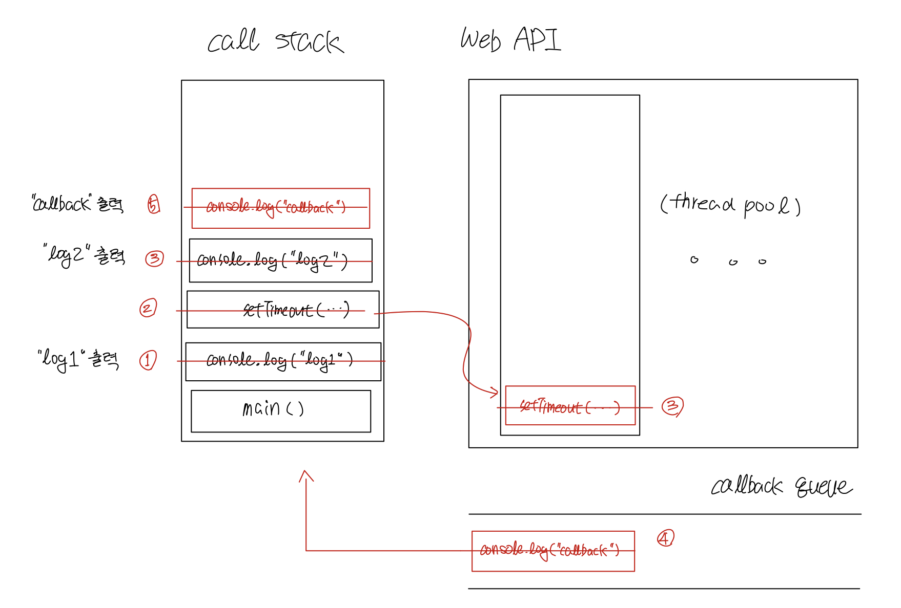

# Asynchronous & Synchronous

> ### references 🔗

웹 브라우저는 **자바스크립트 코드를 하나의 thread에서 실행**시킨다. 

기본적으로 single-threaded 환경에서 실행되는 코드는 동기적(synchronous)으로 실행된다.

**하지만 자바스크립트는 비동기적(asynchronous)으로 실행된다.**


## Contents		
* ### [Synchronous](https://github.com/mingeun2154/skill/tree/main/JS/asynchronous#asynchronous--synchronous#synchronous-1)
* ### [Asynchronous](https://github.com/mingeun2154/skill/tree/main/JS/asynchronous#asynchronous--synchronous#asynchronous-1) 
* ### [비동기 함수의 실행](https://github.com/mingeun2154/skill/tree/main/JS/asynchronous#asynchronous--synchronous#asynchronous-function)

#    

## Synchronous
> 동기화와 관련된 개념들의 핵심은 **순서**이다.

**동기적** = **동기화되어있다**

**동기화되어있다** = 코드의 실행이 프로그래머의 **의도한 순서대**로 실행된다

결국 **코드가 동기적으로 실행**된다는 뜻은 프로그래머가 작성한대로 **위에서부터 아래로 한 줄 씩 실행**된다는 뜻이다.


## Asynchronous
**비동기적으로 실행**된다 = **동기적으로 실행되지 않는다** = 코드가 눈에 보이는 **순서대로 실행되지 않는다**

single-threaded 환경에서 실행되는 자바스크립트를 비동기적으로 실행시키는 이유는 무엇일까 🤔

[blocking function](https://github.com/mingeun2154/skill/tree/main/JS/howDoesItWork#blocking-function)이 호출되어도 웹 페이지가 정상적으로 동작하도록 하기 위함이다.

## Asynchronous function

### 비동기 함수의 실행 과정
* JavaScript 코드가 실행되다가 `setTimeout()`, `fetch()`, `eventListener()`와 같은 함수들을 만나면 해당 함수들을 **Web API의 새로운 thread**에서 실행시킨다.
* main thread에서는 자바스크립트 코드가 실행되고, web api thread에서는 위와 같은 함수들이 실행된다.
* 이 함수들의 실행이 끝나면 callback이 callback queue에 삽입된다.
* callback queue에 삽입된 함수들은 event loop에 의해 call stack에 삽입되고 실행된다.


```JavaScript
console.log("log1");
setTimeout(() => {console.log("callback");}, 1000);
console.log("log2");
```
> 실행 결과  
> log1   
> log2  
> callback   
> (callback은 log2가 출력되고 1초 후에 출력된다.)



> creation phase에 call stack에 context가 삽입되고 execution pahse에 실행되고 stack에서 삭제되는 과정이 반복된다.

* ①  `console.log("log1")` 실행 - "log1" 출력
* ②  `setTime()` 함수를 실행하기 위한 thread 생성
* ③  `console("log2")` 실행 - "log2" 출력
* ③  `setTimeout()` 실행 - 1초 기다림. **main thread가 아닌 스레드에서 실행되기때문에 1초동안 block되지 않는다.**
* ④  1초가 지난 뒤 `console.log("callback")`이 callback queue에 삽입된다.
* ⑤  call stack이 비어있기 때문에 callback queue의 함수가 call stack에 삽입되고 실행된다. - "callback" 출력
