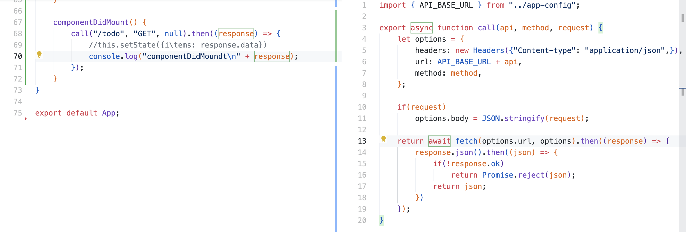
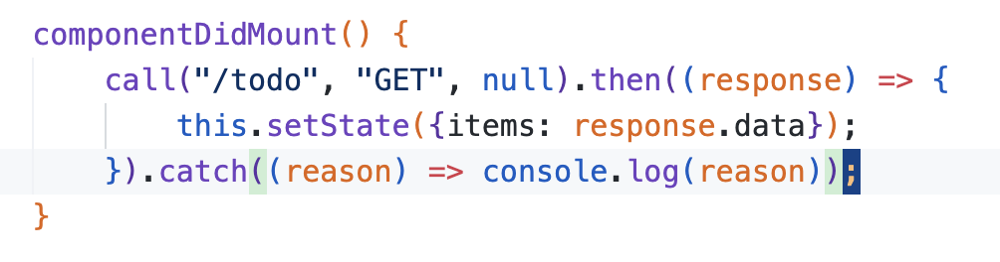

# Fetch API

simple description  

> ### references 🔗

## Contents		
* ### [Fetch API](https://github.com/mingeun2154/skill/tree/main/JS/promise#promise-2)      
* ### [subheading](#)      

#    

## Fetch API
fetch는 자바스크립트가 제공하는 메서드이다. API 서버로 **http 요청을 송신 및 수신할 수 있도록 도와준다.**

`fetch()` 함수는 `Promise`객체를 반환한다. 따라서 `then()`을 통해 콜백을 전달해 응답을 처리할 수 있다.

`catch()` 메서드를 사용해서 **rejected case**에 대한 콜백을 지정할 수도 있다. 

> ### 🚨 `catch()`를 사용할때 주의할 점
> 
> Fetch API의 Promise는 **네트워크 오류** 또는 **CORS 오류**에 대해서만 TypeError를 발생시키고 reject한다.    
> 
> 흔히 볼 수 있는 404 error는 네트워크 오류는 아니므로 `catch()`로는 handle할 수 없다. 

`fetch()`함수는 JSON 을 바로 반환하지 않고 `Response`**객체를 resolve하는** `Promise`**객체를 반환한다.**

`Response`객체는 JSON body가 아닌 **entire HTTP response**를 반환한다.

`Response.json()`메서드는 JSON 형태의 text를 **JavaScript object**로 parsing하고 **이 객체를 감싸는 `Promise`를 반환**한다.

### example 

* `Promise.reject(reason)` - reject된 `Promise`를 반환한다.
* `Response.ok` - HTTP 응답의 state code가 200~299면 true, 아니면 false이다.
* `Promise.catch()` - rejected `Promise`에 대한 콜백을 등록한다. **최종적으로 Promise를 전달받는곳에서 호출한다.** 

