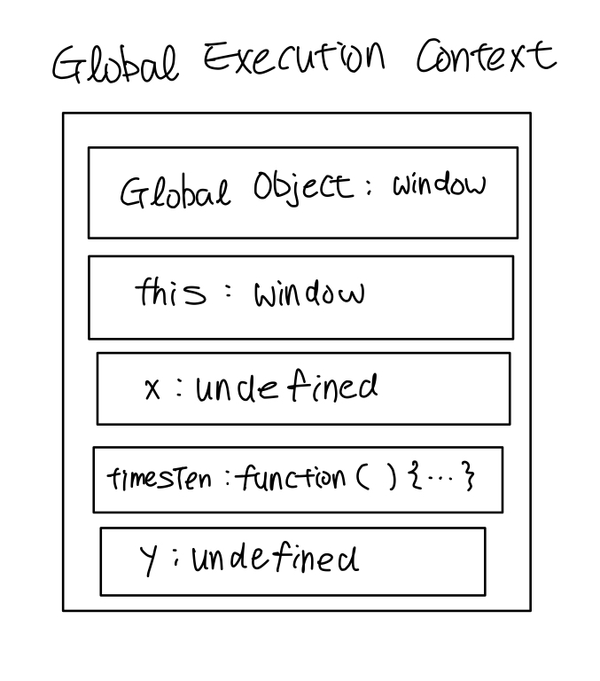
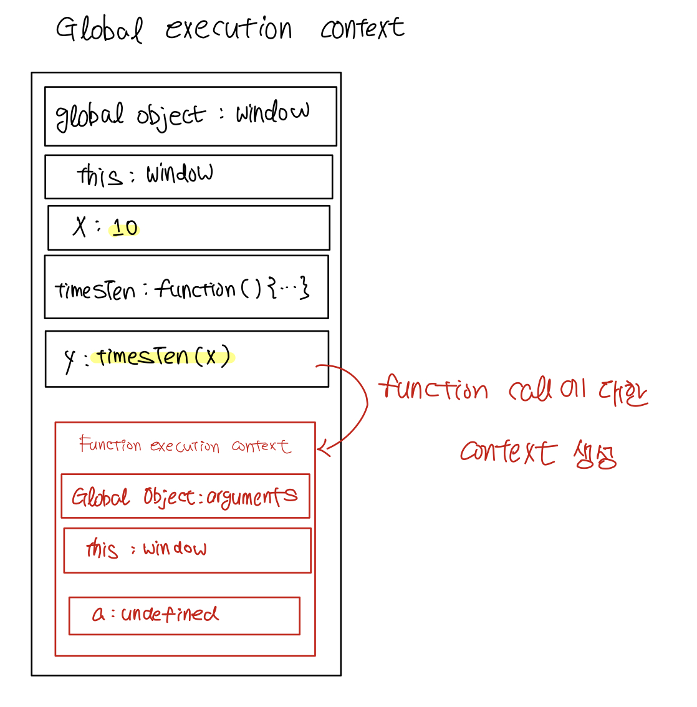
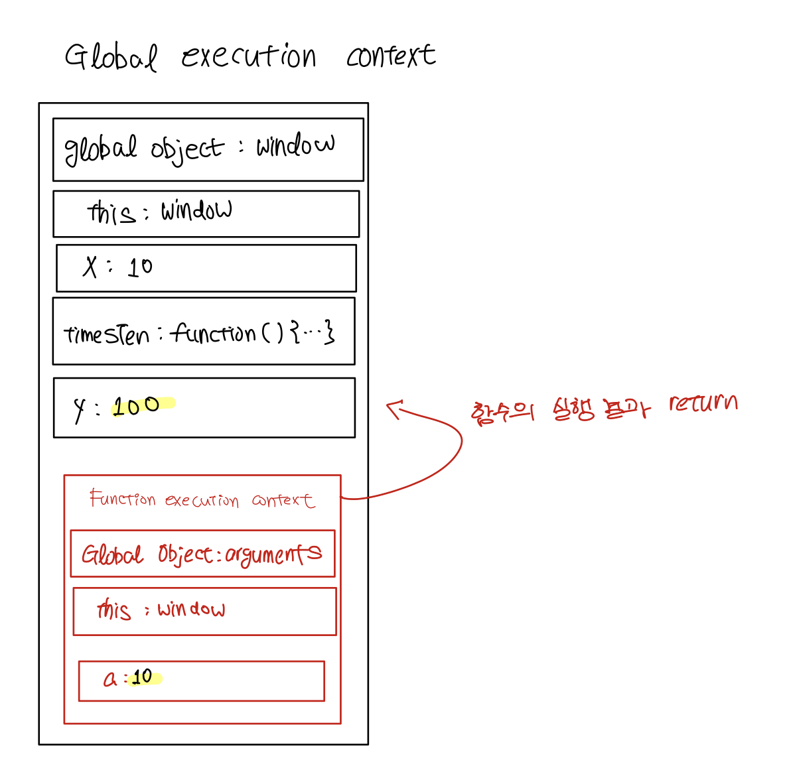

# How browsers execute JavaScript?

브라우저에서 JavaScript가 실행되는 과정
> 출처    
> https://www.javascripttutorial.net/javascript-execution-context/    
> https://www.javascripttutorial.net/javascript-call-stack/

## Contents		
* ### [execution context](#)      
* ### [subheading](#)      
* ### [subheading](#)      
* ### [subheading](#)      

#    

## Execution Context
> 상대방의 말을 이해하려면 맥락을 알고 있어야 한다. 똑같은 단어라도 맥락에 따라 의미가 달라지기 때문이다.    
> 코드도 마찬가지이다.   
> execution context는 말 그대로 **코드 실행에 관한 맥락**을 추상화한 개념이다.    

JavaScript engine이 자바스크립트 코드를 실행시킬 때, 엔진은 execution context를 생성한다.    

execution context는 **두 가지 phase로 구성**된다(**creation phase**와 **execution phase**)

아래의 코드가 실행되는 과정을 살펴보자.    

```JavaScript
let x = 10;

function timesTen(a){
    return a * 10;
}

let y = timesTen(x);

console.log(y); // 100

```
### creation phase
> 자바스크립트 엔진이 **스크립트를 처음 실행** 할때 global execution context를 생성한다.  

global scpoe에 선언된 함수와 변수들을 context에 등록한다(아직 값이 초기화되지는 않는다).

𝐒𝐓𝐄𝐏 𝟎. global execution context 생성(runtime에 대한 환경설정이라고 볼 수 있다.)    

* global object 생성(web browser:`window`, Node.js:`global`)    
* `this` 객체를 생성하고 `global object`에 binding한다.     
* 변수들과 function references를 위한 heap memory 설정.     
* 선언된 함수들을 heap에 저장하고 변수들을 global execution context에 포함된 변수들을 `undefined`로 초기화한다.    

𝐒𝐓𝐄𝐏 𝟏. 본격적으로 위의 코드를 실행하기 위한 설정   
* `x`와 `y`와 함수 `timesTen()`을 global execution context에 저장한다.
* `x`, `y`를 `undefined`로 초기화한다.
	
    

> creation phase가 끝나면 global execution context는 이런 모습이다.

### execution phase
> creation phase가 끝나면 global execution context는 execution phase로 넘어간다.     

execution phase동안 자바스크립트 엔진은 **코드를 한 줄 씩 실행한다.** **변수에 값을 대입**하고 **함수의 호출**을 실행한다.

코드를 실행하다가 함수 호출을 만나면 엔진은 **function execution context를 초기화**한다.

function execution context와 global execution context는 유사하다.

function execution context에서는 global object로 `arguments`가 생성된다. 이 객체를 통해 전달받은 모든 argument에 접근할 수 있다.

`this`는 caller인 window를 가리키고 있다.



> 변수에 값이 대입되고 함수 호출을 위한 context가 생성되었다.

function execution context 초기화가 끝나면 엔진은 **이 context에 대한 execution phase로 진입**한다.

> a에 10이 대입되고 함수의 결과가 global execution context로 return된다. 

## Call Stack

## subheading

## subheading

## subheading
