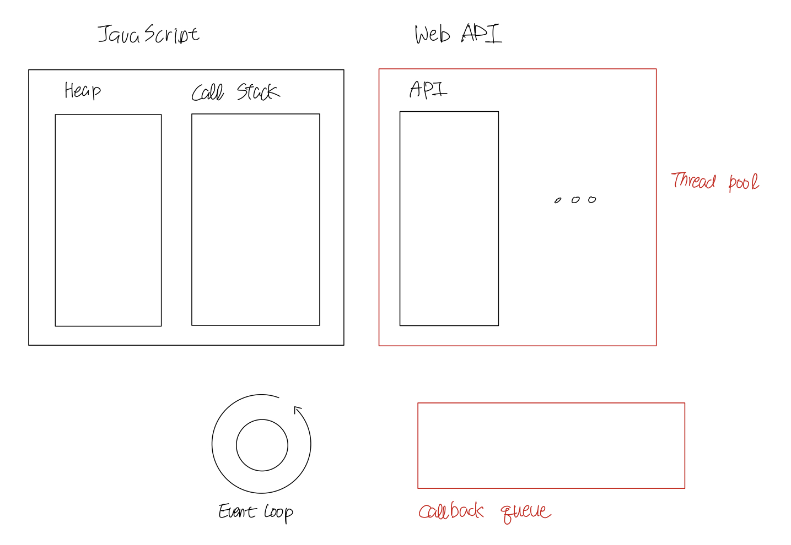
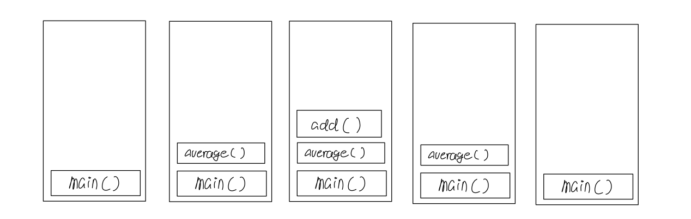
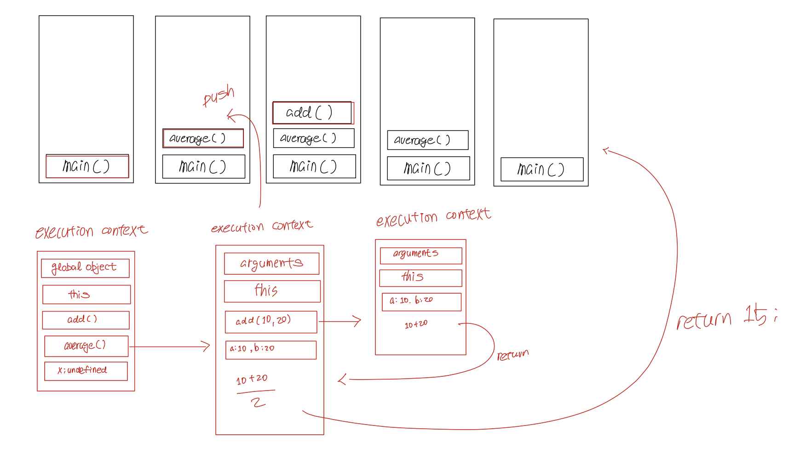
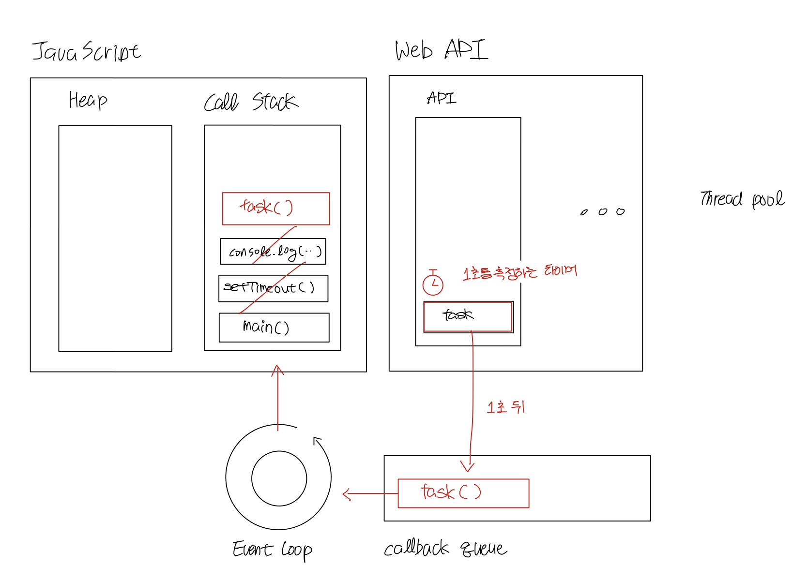

# How browsers execute JavaScript?

JavaScript의 실행
> ### references 🔗   
> https://www.javascripttutorial.net/javascript-execution-context/    
> https://www.javascripttutorial.net/javascript-call-stack/     
> https://www.javascripttutorial.net/javascript-event-loop/    

## Contents		
* ### [Runtime](https://github.com/mingeun2154/skill/tree/main/JS/howDoesItWork#runtime-1)      
* ### [Execution Context](https://github.com/mingeun2154/skill/tree/main/JS/howDoesItWork#execution-context-1)      
* ### [Call Stack](https://github.com/mingeun2154/skill/tree/main/JS/howDoesItWork#call-stack-1)      
* ### [Event Loop](https://github.com/mingeun2154/skill/tree/main/JS/howDoesItWork#event-loop-1)      

#    

## Runtime
> 실행중인 시점, 또는 실행환경을 의미한다.

JavaScript의 런타임 구조



> 큰 그림을 먼저 파악하고 각 부분들에 대해 알아보자.

## Execution Context
> 상대방의 말을 이해하려면 맥락을 알고 있어야 한다. 똑같은 단어라도 맥락에 따라 의미가 달라지기 때문이다.    
> 코드도 마찬가지이다.   
> execution context는 말 그대로 **코드 실행에 관한 맥락**을 추상화한 개념이다.    

JavaScript engine이 자바스크립트 코드를 실행시킬 때, 엔진은 execution context를 생성한다.    

execution context는 **두 가지 phase(단계)**를 거친다(**creation phase(초기화)**와 **execution phase(실행)**)

아래의 코드가 실행되는 과정을 살펴보자.    

```JavaScript
let x = 10;

function timesTen(a){
    return a * 10;
}

let y = timesTen(x);

console.log(y); // 100

```
### creation phase
> 자바스크립트 엔진이 **스크립트를 처음 실행** 할때 global execution context를 생성한다.  

global scpoe에 선언된 함수와 변수들을 context에 등록한다(아직 값이 초기화되지는 않는다).

𝐒𝐓𝐄𝐏 𝟎. global execution context 생성(runtime에 대한 환경설정이라고 볼 수 있다.)    

* global object 생성(web browser:`window`, Node.js:`global`)    
* `this` 객체를 생성하고 `global object`에 binding한다.     
* 변수들과 function references를 위한 heap memory 설정.     
* 선언된 함수들을 heap에 저장하고 변수들을 global execution context에 포함된 변수들을 `undefined`로 초기화한다.    

𝐒𝐓𝐄𝐏 𝟏. 본격적으로 위의 코드를 실행하기 위한 설정   
* `x`와 `y`와 함수 `timesTen()`을 global execution context에 저장한다.
* `x`, `y`를 `undefined`로 초기화한다.
	
    

> creation phase가 끝나면 global execution context는 이런 모습이다.

### execution phase
> creation phase가 끝나면 global execution context는 execution phase로 넘어간다.     

execution phase동안 자바스크립트 엔진은 **코드를 한 줄 씩 실행한다.** **변수에 값을 대입**하고 **함수의 호출**을 실행한다.

코드를 실행하다가 함수 호출을 만나면 엔진은 **function execution context를 초기화**한다.

function execution context와 global execution context는 유사하다.

function execution context에서는 global object로 `arguments`가 생성된다. 이 객체를 통해 전달받은 모든 argument에 접근할 수 있다.

`this`는 caller인 window를 가리키고 있다.


> 변수에 값이 대입되고 함수 호출을 위한 context가 생성되었다.

function execution context 초기화가 끝나면 엔진은 **이 context에 대한 execution phase로 진입**한다.

> a에 10이 대입되고 함수의 결과가 global execution context로 return된다. 

## Call Stack
> execution context(global, function execution context)들을 관리하는 자료구조이다.

### 브라우저가 call stack을 사용하는 방법
* JavaScript 파일을 실행하면 엔진은 global execution context를 생성해서 call stack의 top에 push한다.
* 함수가 호출될때마다, 엔진은 **function execution context를 생성하고 call stack에 push하고, 함수를 실행**한다.
* 함수가 다른 함수를 호출할 경우, 엔진은 function execution context를 생성하고 call stack에 push하고, 함수를 실행한다.    
새로 push된 함수가 종료되면 그 context는 스택에서 제거되고 이전에 실행하던 함수를 이어서 실행한다.
* script는 call stack이 빌 때까지 실행된다.

### call stack example

```JavaScript
function add(a, b) {
    return a + b;
}

function average(a, b) {
    return add(a, b) / 2;
}

let x = average(10, 20);
```

* global execution context(`main()` 또는 `global()`로 표현된다.)
	* creation phase - window, this, 전역변수와 함수 등록
	* execution phase - 코드를 한 줄 씩 실행
* `average()` 함수에 대한 context를 생성하여 call stack에 추가.
	* 엔진은 call stack의 top에 있는 `average()` 함수를 실행한다.
* `add()` 함수에 대한 context를 생성하여 call stack에 추가한다.
	* `add()` 함수가 실행, 종료되고 스택에서 제거된다.
* 스택의 top에 있는 `average()`가 다시 실행된다.



> 예시 코드가 실행되는 동안의 call stack의 변화.   
> call stack의 top에 있는 함수가 현재 실행중인 함수이다.



> 예시 코드가 실행되는 과정을 좀 더 자세히 나타낸 그림.   

모든 execution context들은 **초기화(symbol 등록, undefined로 초기화)**, **실행(symbol에 값을 대입하고 계산)의 단계**를 거친다.

### Stack Overflow
**call stack의 크기는 고정**되있다. (크기는 host environment에 따라 다르다.)

execution context가 call stack의 크기보다 많아지면 stack overflow error가 발생한다.

```JavaScript
function fn() {
    fn();
}

fn(); // stack overflow
```

## Event Loop

JavaScript는 **single-threaded** programming language이다. (JavaScript로는 **한 번에 하나의 작업(함수)만 실행**할 수 있다.)

자바스크립트 엔진은 다음과 같은 과정을 반복하며 코드를 위에서부터 아래로 한 줄 씩 실행한다.
* **creation phase** - execution context를 만들어서 call stack에 push.
* **execution phase** - call stack의 top에 있는 함수를 실행하고 스택에서 제거한다.

### blocking function
**실행시간이 긴** 함수. 해당 시간동안 웹 페이지의 모든 interaction이 차단된다. (사용자가 어딜 클릭해도 반응하지 않는다.)

### example : blocking function

```JavaScript
function task(message) { // blocking function
    // emulate time consuming task
    let n = 10000000000;
    while (n > 0){
        n--;
    }
    console.log(message);
}

console.log('Start script...');
task('Call an API');
console.log('Done!');

// 실행결과
Start script.... // 13초 뒤 다음 문장이 출력되었다. 13초 동안 웹사이트(유튜브) 어디를 클릭해도 반응이 없었다.
Call an API.
Done!
```

### example : callback
> callback이란 **나중에 실행하기 위해** 다른 함수에게 인자로서 넘겨주는 함수이다. 

```JavaScript
console.log('Start script...');

setTimeout(() => {
    task('Download a file.');
}, 1000);

console.log('Done!');

// 실행결과
Start script.... 
Done! // 13초 뒤 다음 문장이 출력되었다. 13초 동안 반응이 없는 것은 동일했다.
Call an API.
```
위의 코드에서는 `Start script...` 와 `Done!` 이 바로 출력된다.

앞서 말했듯, JavaScript 엔진은 한 번에 하나의 작업만 할 수 있다. 

조금 더 정확히 말하자면, **JavaScript runtime**은 한 번에 한 가지 일만 할 수 있다.

웹 브라우저는 JavaScript 뿐만 아니라 다른 component를 가지고 있다.

프로그래머가 `setTimeout()`, `fetch()`, `eventListner()` 등을 호출하면 **브라우저는 이 작업들을 동시에, 비동기적으로 처리한다.** 

`setTimeout()`, fetch request, DOM event는 모두 웹 브라우저의 **Web APIs**의 일부분이다.

### example : setTimeout()의 실행
* 코드를 실행하다가 `setTimeout()` 함수를 만난다.
* `setTimeout()` 에 대한 context를 만들어 stack에 넣고 실행한다.
	* Web API가 1초를 측정하는 timer를 생성한다. `setTimeout()`이 stack에서 제거된다.
* `console.log('Done!')` 이 실행된다. **동시에 timer는 시간을 재고 있다.**
* timer가 만료되면 Web API에 의해 `task()`가 callback queue에 삽입된다.
* event loop는 지속적으로 callback queue와 call stack을 감시한다.
* **call stack에 더 이상 실행함 함수가 없는 경우**, event loop는 callback queue의 함수를 call stack에 넣는다.



`setTimeout()`에 전달된 인자가 `0`인 경우에도 위와 같은 순서로 실행된다.
> 0초와 같은 특수한 케이스에 대한 별도의 handler는 없다.      
> [특수한 케이스를 빠르게 처리하려고 할 수록 코드가 복잡해지고 성능면에서도 비효율적이다.](https://github.com/mingeun2154/CS/tree/main/ComputerArchitecture/eightGreatIdea#3-make-the-common-case-fast)
