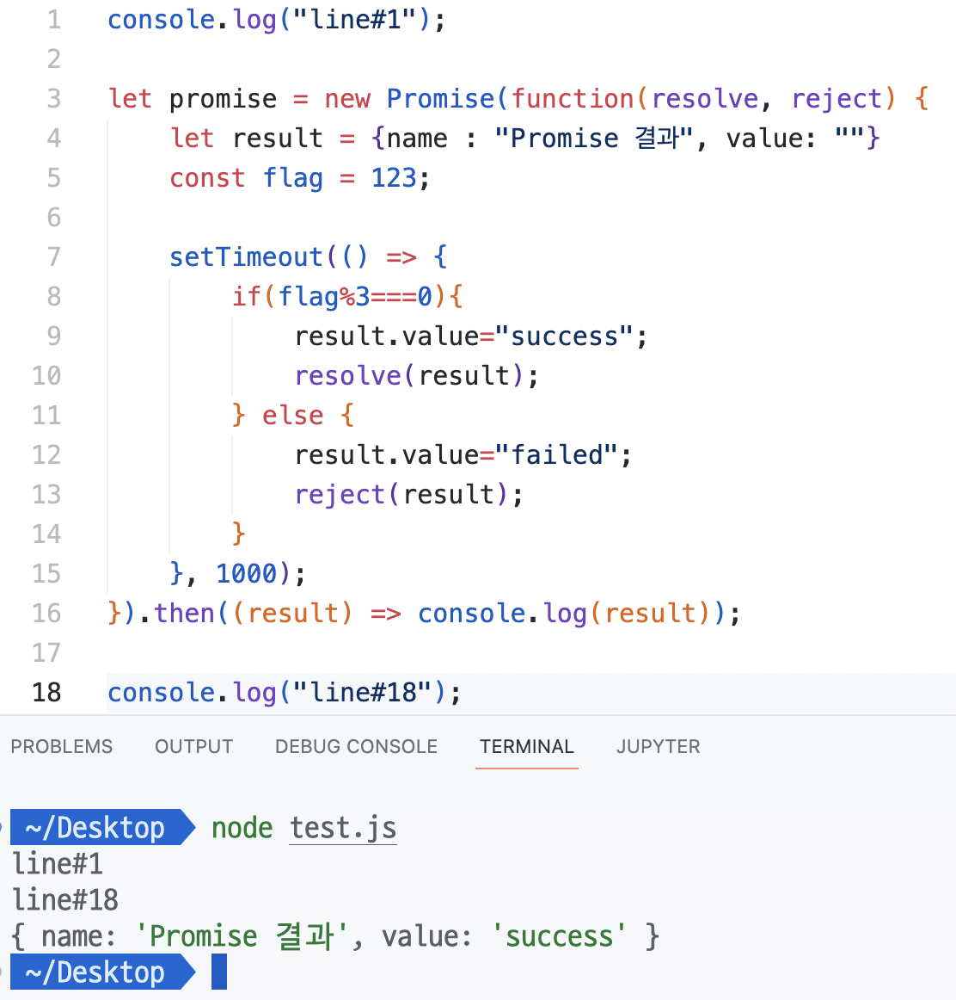
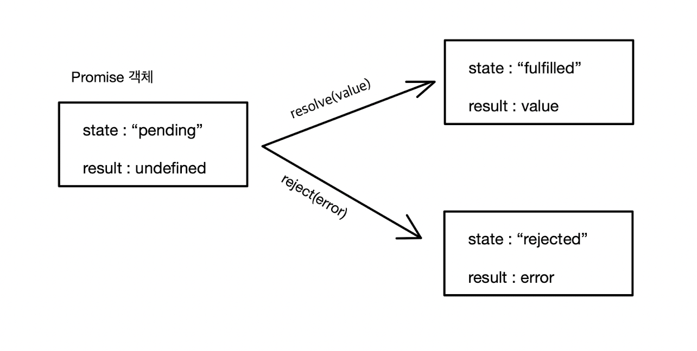

# Promise

> ### references 🔗  
> React.js, 스프링 부트, AWS로 배우는 웹 개발 101		- 김다정 -    
> https://www.w3schools.com/js/js_promise.asp     
> https://ko.javascript.info/promise-basics

## Contents		
* ### [Promise 생성](https://github.com/mingeun2154/skill/tree/main/JS/promise#promise-1)      
* ### [Promise의 상태](https://github.com/mingeun2154/skill/tree/main/JS/promise#promise%EC%9D%98-%EC%83%81%ED%83%9C-1)
* ### [then()](https://github.com/mingeun2154/skill/tree/main/JS/promise#then-1)      
* ### [catch()](https://github.com/mingeun2154/skill/tree/main/js/promise#catch-1)
* ### [finally()](https://github.com/mingeun2154/skill/tree/main/js/promise#finally-1)
* ### [Promise Chaining](https://github.com/mingeun2154/skill/tree/main/JS/promise#promise-chaining-1)

## Promise
**원하는 작업(executor)과 그 결과값**을 감싸는 객체이다. executor를 실행시키고 그 결과를 표현한다.

주로 **비동기 작업**을 실행시킨다.

`Promise`객체는 아래와 같은 방식으로 만들 수 있다.

생성자에 전달되는 함수는 **executor**라고 하며 **결과를 만들어내는 코드**를 포함한다.

executor는 **객체가 생성될 때 자동으로 실행**된다.

`resolve`와 `reject`는 JavaScript가 제공하는 콜백이다. 개발자는 신경쓰지 않고 executor 내부의 코드만 작성하면 된다.

```JavaScript
let promise = new Promise(function(resolve, reject){
		// executor
		// case1. 성공 - resolve(value) 호출
		// case2. 실패 - reject(error) 호출
		});
```

executor 내부에서는 반드시 `resolve()`와 `reject()`함수 둘 중 하나를 호출해야 한다.
* `resolve(value)` - 작업이 성공적으로 끝난 경우 **그 결과를 표현**하는 `value`와 함께 호출한다.
* `reject(error)` - 에러가 발생한 경우 **에러를 표현**하는 `error`와 함께 호출한다.



* executor : `promise` 생성과 동시에 `setTimeout()`이 전달받은 함수가 실행된다. `flag`가 3의 배수이면 성공, 아니면 실패이다. 
* `result` : `promise`가 실행하는 executor의 실행결과를 표현한다.
* `reject()`, `resolve()`를 호출함으로써 main thread에 실행 결과를 알려준다(`result`객체가 전달된다.)

## Promise의 상태
`Promise` 객체는 **세 가지 상태**를 가진다.
* pending : fulfilled도 아니고 reject 상태도 아닌 초기상태
* fulfilled : executor의 실행 성공적으로 완료된 상태
* rejected : executor의 실행이 실패한 상태

executor의 실행이 `Promise`의 상태를 둘 중 하나로 변화시킨다.



> `state`와 `result` 프로퍼티는 내부 프로퍼티로 개발자가 직접 접근할 수 없다.   
> `then`, `catch`, `finally`를 사용하면 접근할 수 있다.

이렇게 resolved(이행) 또는 rejected(거부)된 상태의 `Promise`객체는 **settled Promise**(처리된 Promise)라고 한다. 

반대는 pending(대기상태) Promise이다.

## then()
`Promise.then()` 메서드를 사용해서 성공, 실패에 대한 콜백을 지정할 수 있다. 둘 다 필 수는 아니다.

`then()`**으로 전달하는 메서드의 parameter에는** `Promise`**가 resolve한 값이 전달된다.**

```JavaScript
myPromise.then(
		function(value) {/* 성공 시 실행되는 코드 */}, 
		function(error) {/* 실패 시 실행되는 코드 */}
);
```

`then()`의 첫 번째 인수는 promise가 resolve(성공)했을 때 실행되는 함수이다. 실행 결과를 인수로 받는다.

`then()`의 두 번째 인수는 promise가 rejected(실패)되었을 때 실행되는 함수이다. 인수로 에러를 받는다.

```JavaScript
let promise = new Promise(function(resolve, reject) {
  setTimeout(() => reject(new Error("에러 발생!")), 1000);
});

// reject 함수는 .then의 두 번째 함수를 실행합니다.
promise.then(
  result => alert(result), // 실행되지 않음
  error => alert(error) // 1초 후 "Error: 에러 발생!"을 출력
);
```

> `reject()`함수로 전달할 error는 `Error`객체를 상속하는 객체를 사용하는 것이 좋다.

## catch()
`catch(f)`는 `then(null, f)`과 완벽히 같다.

## finally()
`Promise`가 처리되기만 하면 항상 실행된다.

화면에 더 이상 그만 표시되어도 되는 loading indicator를 멈추는 경우와 같이, **결과가 어떻든 마무리가 필요한 경우**에 유용하다.

* `then()`에 전달되는 핸들러와 다르게 인수가 없다.(성공, 실패 여부를 몰라도 되기 때문이다.)

* `finally` 핸들러는 자동으로 **다음 핸들러에 결과와 에러를 전달**한다.

```JavaScript
new Promise((resolve, reject) => {
  setTimeout(() => resolve("결과"), 2000)
})
  .finally(() => alert("프라미스가 준비되었습니다."))
  .then(result => alert(result)); // <-- .then에서 result를 다룰 수 있음
```

`finally`는 `Promise`의 결과를 처리하기 위해 만들어진 게 아니다.  결과는 `Promise`를 **통과**한다.

## Promise Chaining
promise가 resolve한 결과가 `then` 핸들러의 chain(사슬)을 따라 계속 전달된다. 

`then`은 `Promise`를 반환한다. 핸들러가 반환하는 값이 `Promise`의 `result`가 된다.

```JavaScript
new Promise(function(resolve, reject) {
    setTimeout(() => resolve(1), 1000);
}).then((result) => {
    result=result*2;
    console.log(result);
    return result;
}).then((result) => {
    result=result*2;
    console.log(result);
    return result;
}).then((result) => {
    result=result*2;
    console.log(result);
    return result;
});
```

### 핸들러가 Promise를 반환하는 경우
`then(handler)`의 handler가 `Promise`를 생성하거나 반환하는 경우도 있다.

이 경우 `Promise`를 반환하는 핸들러 이후의 핸들러들은 이 `Promise`가 처리될 때까지 기다렸다가 그 결과를 받는다.

```JavaScript
new Promise(function(resolve, reject) {

  setTimeout(() => resolve(1), 1000);

}).then(function(result) {

  alert(result); // 1

  return new Promise((resolve, reject) => { // (*)
    setTimeout(() => resolve(result * 2), 1000);
  });

}).then(function(result) { // (**)

  alert(result); // 2

  return new Promise((resolve, reject) => {
    setTimeout(() => resolve(result * 2), 1000);
  });

}).then(function(result) {

  alert(result); // 4

});
```
