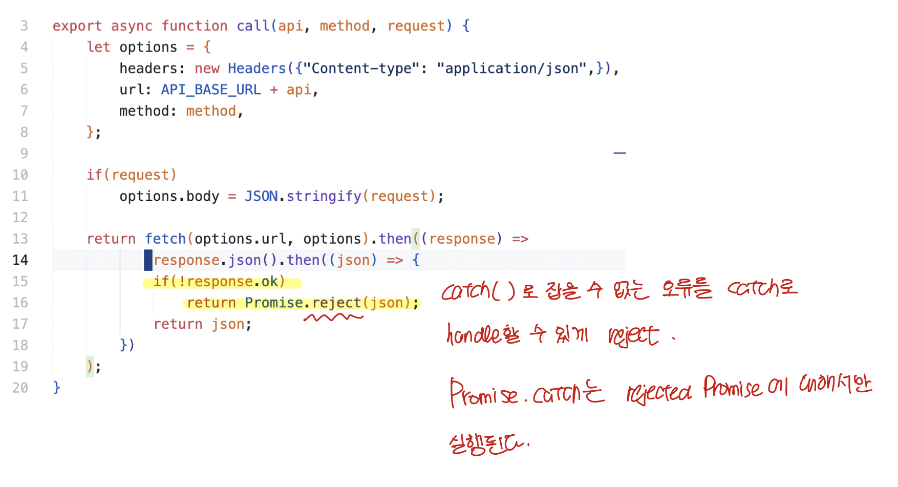
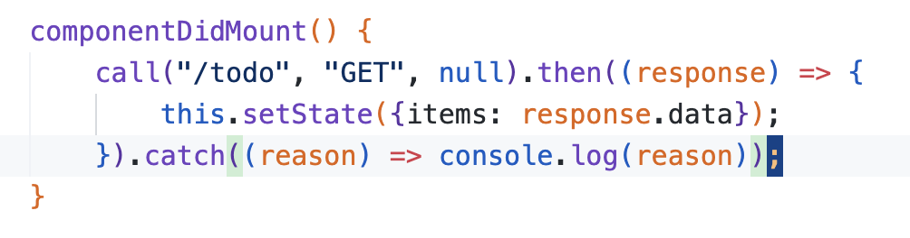

# Promise

> ### references 🔗  
> React.js, 스프링 부트, AWS로 배우는 웹 개발 101		- 김다정 -    
> https://www.w3schools.com/js/js_promise.asp

## Contents		
* ### [Promise란 무엇인가](https://github.com/mingeun2154/skill/tree/main/JS/promise#promise-2)      
* ### [사용 방법](https://github.com/mingeun2154/skill/tree/main/JS/promise#how-to-use)      
* ### [Fetch API](https://github.com/mingeun2154/skill/tree/main/JS/promise#fetch-api-1)      

## Promise
**비동기 작업의 결과값**을 감싸는 객체이다. 비동기 작업의 결과(success value 또는 failure reason)에 대한 콜백을 지정할 수 있다.

`Promise`가 감싸는 값을 `Promise`**객체가 resolve한다**라고 표현한다.

지정된 함수는 비동기 함수의 실행이 완료될 때까지 기다렸다가 반환하는 값을 인수로 받아 실행된다. 

aysnchronous 함수는 `Promise` 객체를 반환함으로 동기적(synchronous) 함수처럼 사용된다. 

`Promise` 객체는 **세 가지 상태**를 가진다.
* pending : fulfilled도 아니고 reject 상태도 아닌 초기상태
* fulfilled : operation이 성공적으로 완료된 상태
* rejected : operation이 실패한 상태

세 가지 상태중 pending이 아닌 상태를 **객체가 settled되었다**라고 표현한다.

## How to use
`Promise.then()` 메서드를 사용해서 성공, 실패에 대한 콜백을 지정할 수 있다. 둘 다 필 수는 아니다.

`then()`**으로 전달하는 메서드의 parameter에는** `Promise`**가 감싼 객체가 전달된다.**

```JavaScript
myPromise.then(
		function(value) {/* 성공 시 실행되는 코드 */}, 
		function(error) {/* 실패 시 실행되는 코드 */}
);
```

## Fetch API
fetch는 자바스크립트가 제공하는 메서드이다. API 서버로 **http 요청을 송신 및 수신할 수 있도록 도와준다.**

`fetch()` 함수는 `Promise`객체를 반환한다. 따라서 `then()`을 통해 콜백을 전달해 응답을 처리할 수 있다.

`catch()` 메서드를 사용해서 **rejected case**에 대한 콜백을 지정할 수도 있다. 

> ### 🚨 `catch()`를 사용할때 주의할 점
> 
> Fetch API의 Promise는 **네트워크 오류** 또는 **CORS 오류**에 대해서만 TypeError를 발생시키고 reject한다.    
> 
> 흔히 볼 수 있는 404 error는 네트워크 오류는 아니므로 `catch()`로는 handle할 수 없다. 

`fetch()`함수는 JSON 을 바로 반환하지 않고 `Response`**객체를 resolve하는** `Promise`**객체를 반환한다.**

`Response`객체는 JSON body가 아닌 **entire HTTP response**를 반환한다.

`Response.json()`메서드는 JSON 형태의 text를 **JavaScript object**로 parsing하고 **이 객체를 감싸는 `Promise`를 반환**한다.

### example 



* `Promise.reject(reason)` - reject된 `Promise`를 반환한다.
* `Response.ok` - HTTP 응답의 state code가 200~299면 true, 아니면 false이다.
* `Promise.catch()` - rejected `Promise`에 대한 콜백을 등록한다. **최종적으로 Promise를 전달받는곳에서 호출한다.** 


