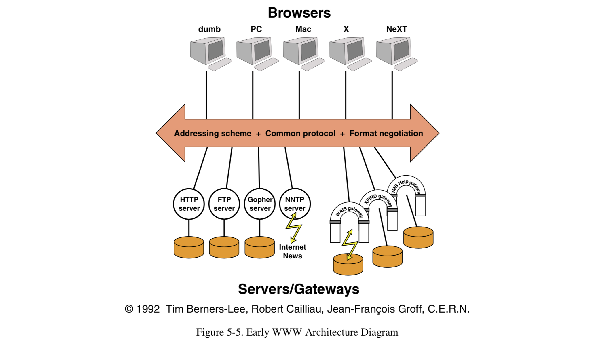

# REST

> ### references 🔗     
> https://www.youtube.com/watch?v=iOueE9AXDQQ    
> 그런 REST API로 괜찮은가   
> Architectural styles and the design of network-based software architecture 𝐂𝐇𝐀𝐏𝐓𝐄𝐑 𝟓

## Contents		
* ### [WEB](https://github.com/mingeun2154/skill/tree/main/web/REST#web-1)      
* ### [REST가 지켜야할 제약조건들](https://github.com/mingeun2154/skill/tree/main/web/REST#hybrid-architecture-style)      
* ### [Uniform Interface](#)      

#    

## WEB
WEB은 인터넷을 통해 정보를 공유하기 위해 등장했다.

정보들을 **HTML**로 표현하고, 하이퍼텍스트로 연결한다. 각 HTML을 식별하기 위해 **URI**를 만들고 전송하는 방식으로 **HTTP**를 만들었다.

## Hybrid Architecture Style
Roy Thomas Fielding의 박사 논문 *Architectural styles and the design of network-based software architecture*에서 처음 등장했다.

REST는 분산 하이퍼미디어 시스템(예를 들면 웹)을 위한 아키텍쳐 스타일이면서 

아래 6개의 네트워크 기반 아키텍쳐 스타일이 합쳐진(derived) hybird 스타일이다.

> 아키텍쳐 스타일이란 제약 조건(constraint)들의 집합이다.

* [Client-Server](https://github.com/mingeun2154/skill/tree/main/web/REST#client-server)
* [Stateless](https://github.com/mingeun2154/skill/tree/main/web/REST#stateless)
* [Cache](https://github.com/mingeun2154/skill/tree/main/web/REST#cache)
* [Uniform Interface](https://github.com/mingeun2154/skill/tree/main/web/REST#uniform-interface-1)
* [Layered System](https://github.com/mingeun2154/skill/tree/main/web/REST#layered-system)
* [Code-On-Demand](https://github.com/mingeun2154/skill/tree/main/web/REST#code-on-demand)

### Client-Server
REST에 더해지는 첫 번째 제약조건은 client-server architectural style이다. 이 제약조건의 원칙은 **관심사(concern)의 분리**이다.

사용자 인터페이스에 대한 관심사를 데이터 저장에 대한 관심사로부터 분리함으로써, 여러 플랫폼들에 대한 이식성을 개선할 수 있다.

그리고 서버 컴포넌트들의 간소화를 통해서는 확장성을 개선할 수 있다. 하지만 웹에게 가장 중요한 것은, 이러한 분리가 컴포넌트들이

**독립적으로 진화**하여 여러 도메인들의 요구사항을 지원할 수 있게 된다는 것이다.

### Stateless
다음으로는 클라이언트와 서버 사이의 상호작용(interaction)에 다음과 같은 제약을 추가한다. 

통신은 본질적으로 stateless해야 한다. 즉, 클라이언트가 서버에 보내는 모든 요청들은 반드시 **서버가 해당 요청을 이해하는 데**

**필요한 모든 정보를 포함**하고 있어야 한다. 그러므로 세션 상태는 전적으로 클라이언트에 보관되어야 한다.

이런 제약들은 가시성(visibility), 신뢰성(reliability), 그리고 확장성(scalability)을 초래한다.

모니터링 시스템은 각 요청의 전체 내용을 파악하기 위해 그 요청 이상을 볼 필요가 없기 때문에 가시성이 개선된다.

부분적 오류(failures)로부터의 복구가 쉽기 때문에 신뢰성이 개선된다.

클라이언트의 요청들에 대한 상태를 저장할 필요가 없기 때문에 서버 컴포넌트는 자원(요청을 처리하는 데 필요한 메모리 등)을 빠르게 

해제할 수 있고 구현이 간단해져 확장성이 개선된다.

다른 대부분의 아키텍쳐들이 그렇듯, stateless 제약은 단점도 존재한다. 그것은 일련의 요청들에 반복적인 데이터들이 전송되어

네트워크 성능을 저하한다는 점이다. 추가적으로 애플리케이션의 상태를 클라이언트측에 저장하는 것은 앱의 일관된 작동을 위한

서버의 제어를 저하한다. 애플리케이션이 여러 가지 클라이언트 버전에 의존하게 되기 때문이다.

### Cache
네트워크 효율을 개선하기 위해, 캐시 제약을 추가했다. 캐시 제약은 요청에 대한 응답에 포함된 데이터가 명시적 또는 암시적으로 

**cacheable인지 non-cacheable인지 표현**되야한다는 것이다. 만약 cacheable이라면, 클라이언트 캐시는 이후에 발생할 동일한 

요청을 위해 해당 응답을 재사용(저장) 할 수 있는 권한을 얻게 된다.

캐시 제약의 장점은 부분적으로 혹은 전체적으로 몇몇 상호작용(데이터 교환)을 제거하여 효율, 확장성, 그리고 유저 입장에서의 

성능을 개선할 수 있다는 점이다. 하지만 감수해야 하는 단점은 캐시에 저장된 상태 정보가 요청이 서버로 직접 전송되었을때 얻을 

데이터와 심각하게 다른 경우 신뢰성이 떨어질 수 있다.

그림과 같은 초기의 웹 아키텍쳐는 client-cache-stateless-server 제약들의 집합으로 정의되었다. 

즉, 1994년 전에 존재했던 웹 아키텍쳐는 인터넷을 통해 정적 문서(static document)들을 교환하는 서버와 클라이언트의 stateless 

상호작용에 초점을 맞추었다. 그런 통신을 위한 프로토콜들은 non-shared caches를 위한 아주 기초적인 기능만을 지원할 뿐 

인터페이스를 모든 자원에 대한 일관된 의미론적 집합으로 제한하지 않았다. 대신, Web은 웹 애플리케이션들 사이의 일관성을 유지하기

위해 공통된 client-server 구현 라이브러리(CERN libwww)에 의지하고 있었다.

Web implementations 개발자들은 이미 초기의 디자인을 뛰어 넘었다. 정적 문서들 뿐만 아니라, 요청들은 동적으로 생성되는 

서비스들을 식별할 수 있었다. 중재자(intermediary) 컴포넌트들에 대한 작업도 프록시와 shared cache의 형태로 이미 시작되었었다.

하지만 좀 더 신뢰할 수 있는 통신을 위한 프로토콜의 확장이 필요했다.

### Uniform Interface
REST 아키텍쳐 스타일을 다른 네트워크 기반 스타일들과 구별하는 중심적인 특징은 **컴포넌트 사이의 획일적인 인터페이스에 중점**을

두는 것이다. (Figure 5-6 참고) 컴포넌트 인터페이스에 대한 일반성(generality) 원칙을 적용함으로써 전체 시스템의 구조가 

단순해지고 상호작용의 가시성이 개선된다. 구현체(Implementation)들은 그들이 제공하는 서비스와 분리되어 **독립적인 진화**가 

발생하도록 한다. 

> 독립적 진화란 무엇인가?   
> 서버와 클라이언트가 각각 독립적으로 진화한다.   
> **서버의 기능이 변경되어도 클라이언트를 업데이트할 필요가 없다.**     
> Roy T. Fielding이 REST를 만들게 된 계기 : How do I improve HTTP without breaking the Web?

> web 기술 자체는 REST를 잘 따른다    
> 웹 페이지를 변경했다고 웹 브라우저를 업데이트할 필요가 없다. 반대도 마찬가지이다.   
> HTTP, HTML spec이 변경되어도 웹은 잘 작동한다.     

> 어떤 종류의 서버에 접근하는 지 상관 없이 동일한 인터페이스를 통해 접근한다.

획일적인 인터페이스는 효율을 감소시키는 단점이 있다. 애플리케이션의 필요에 맞추는 것이 아니라 표준화된 형태로

데이터가 전송되기 때문이다. REST 인터페이스는 Web의 일반적인 상황에 최적화하기 위해 large grain hypermedia 데이터 전송에 대해 

효율적으로 설계되었다. 하지만 다른 형태의 architectural interaction에 대해서는 최적화되어있지 않다.

획일화된 인터페이스를 얻기 위해, 몇 가지 제약이 컴포넌트의 행동을 가이드하기 위해 필요하다.

**REST는 다음과 같은 네 가지 인터페이스 제약조건들에 의해 정의된다**

* [idendtification of resources](#)
* [manipulation of resources through representation](#)
* [**self descriptive message**](#)
* [**hypermedia as the engine of application state**](#)

> 마지막 두 가지를 지키는 REST API는 별로 없다고 한다.

### Layered System
인터넷급의 요구사항들에 대한 행동(behavior)을 개선하기 위해 계층(layered) 시스템 제약조건을 추가했다. 계층적 시스템 스타일은

아키텍쳐를 구성하는 컴포넌트들이 자신과 상호작용하는 인접한 계층만 볼 수 있도록 제한한다.

## subheading
