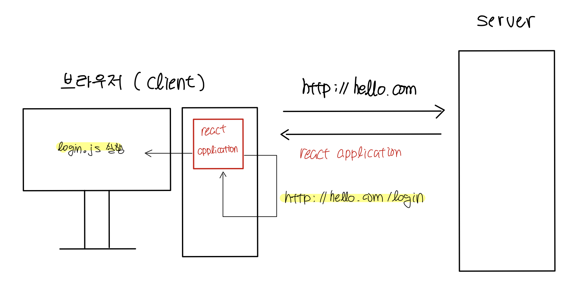

# SPA

> ### references 🔗
> React.js, 스프링 부트, AWS로 배우는 웹 개발 101   
> Wikipedia   

## Contents		
* ### [SPA란 무엇인가](https://github.com/mingeun2154/skill/tree/main/web/spa#spasingle-page-application)      
* ### [SPA 렌더링 과정](https://github.com/mingeun2154/skill/tree/main/web/spa#rendering-process)
* ### [클라이언트-사이드 렌더링](https://github.com/mingeun2154/skill/tree/main/web/spa#client-side-rendering)      
* ### [서버-사이드 라우팅](https://github.com/mingeun2154/skill/tree/main/web/spa#server-side-routing)
* ### [클라이언트-사이드 라우팅](https://github.com/mingeun2154/skill/tree/main/web/spa#client-side-routing)      
* ### [장점](https://github.com/mingeun2154/skill/tree/main/web/spa#%EC%9E%A5%EC%A0%90-1)      
* ### [단점](https://github.com/mingeun2154/skill/tree/main/web/spa#%EB%8B%A8%EC%A0%90-1)      

#    

## SPA(Single Page application)
SPA 한 번 웹 페이지를 로딩하면 사용자가 '새로고침'하지 않는 이상 페이지를 새로 로딩하지 않는 애플리케이션이다.

새로운 html 문서를 가져오지 않고 **하나의 html 문서를 실시간으로 다시 작성함**으로써 사용자와 상호작용한다.

React나 Angular는 대중적인 SPA 프레임워크/라이브러리다.

## Rendering process
> React 기준

* SPA 웹 페이지에 접속하면 브라우저는 **index.html**을 렌더링한다. 
* index.html에는 **bundle.js**가 포함되어 있어 실행한다.
* bundle.js는 `npm start`를 실행했을 때 만들어진 파일인데 **index.js**를 포함하고 있다.
* index.js의 **ReactDom.render()** 함수가 실행된다.
* **render()** 함수가 동적으로(runtime) React component들을 HTML element로 만들어 화면에 보여준다.

## Client-Side Rendering
SPA에서 현재 웹 페이지를 바꾸기 위해서 root 하위의 element를 다른 element로 수정한다.

브라우저의 자바스크립트는 `fetch, ajax` 등의 함수로 서버에 데이터를 요청하고 받은 데이터를 이용해 자바스크립트를 통해 HTML을 재구성한다.

이렇게 서버에 새 HTML 페이지를 요청하지 않고 클라이언트의 자바스크립트가 동적으로 HTML을 재구성해 만드는 클라이언트 애플리케이션을 SPA(Single Page Application)이라고 하고 이 렌더링 과정을 Client-Side Rendering이라고 한다.

## Server-Side Routing
> 라우팅(routing) : 클라이언트가 요청한 url에 따라 적절한 페이지를 보여줌.


클라이언트가 `http://hello.com` 주소로 접속하면 서버는 `index.html` 을 렌더링해서 클라이언트에게 전송한다.

그리고 `http://hello.com/login` 주소를 입력하면 서버는`login`이라는 경로를 보고 `login.html`을 렌더링해서 반환한다.

이런 라우팅 과정을 server-side routing이라고 한다. 

## Client-Side Routing
하나의 페이지에서만 동작하는 싱글 페이지 애플리케이션은 **client-side routing을 이용해 요청 url에 따라 다른 화면**을 보여준다.

이 방식은 서버로 어떤 요청도 보내지 않는다. 모든 라우팅은 클라이언트 코드, 자바스크립트가 해결한다. 



처음 웹 페이지에 접속하면 이후에 필요한 모둔 리소스(html, css, javascript 파일)이 포함된 리액트 애플리케이션을 다운받는다.

그리고 `http://hello.com/login`을 주소창에 입력하면 **리액트 라우터**가 이 요청을 가로챈다.

이 리액트 라우터는 url을 분석하여 적절한 컴포넌트를 렌더링한다. 

요청에 대한 응답이 클라이언트 내부에서 생성되기 때문에 로그인 페이지를 보여주는 동작 자체는 인터넷이 끊기더라도 실행된다.

클라이언트-사이드 라우팅을 적용하기 위해서는 **라이브러리가 필요**하다.

```Bash
$ npm install react-router-dom
```


> router 컴포넌트 정의

      


> router 컴포넌트 적용

## 장점
* 사용자의 입력에 대해 ui를 바꿔야 할 때 전체 페이지를 다시 요청하지 않기 때문에 트래픽이 감소한다.
* 앱처럼 자연스로운 ux를 제공한다.
* 프론트엔드와 백엔드가 비교적 명확하게 구분된다.  
* 컴포넌트별 개발로 ui를 모듈화할 수 있다.

## 단점
* 웹 애플리케이션에 필요한 정적 리소스를 한 번에 다운받기 때문에 초기 구동 속도가 느리다.
* SEO(검색엔진 최적화)에 불리하다.
> 검색 엔진에게는 JavaScript가 적용되지 않은 빈 html만 보이기 때문에 웹 페이지의 내용이 노출되지 않는다.     
> body tag는 안 보여도 head tag는 보이니까 head에 최대한 정보를 많이 집어넣는게 좋을 것 같다...🤔
