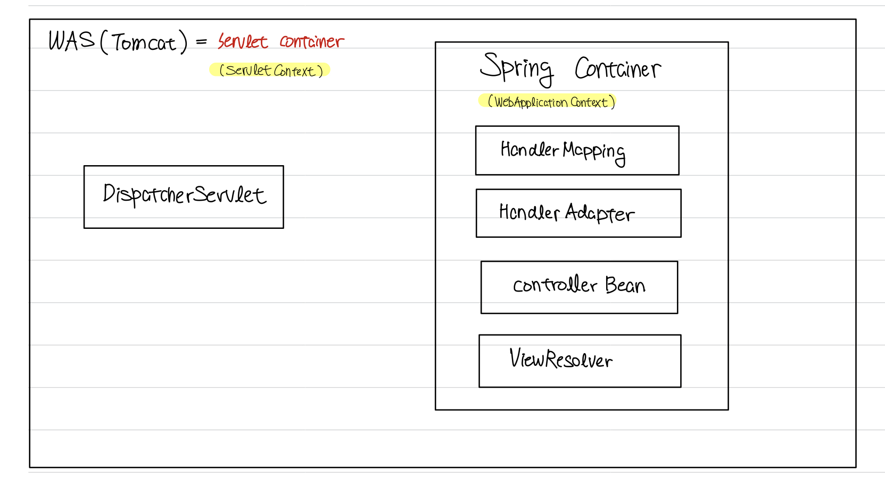
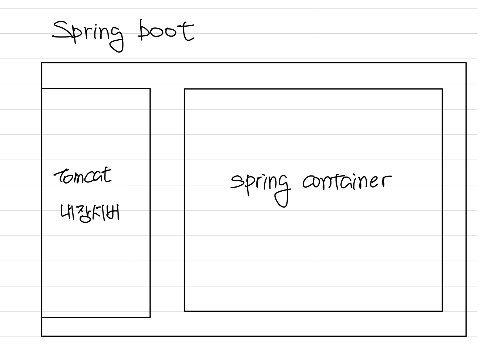

# Web Server

> ### references 🔗
> 생활코딩! HTML+CSS+자바스크립트    
> 초보 웹 개발자를 위한 스프링5    
> https://www.inflearn.com/course/%EC%8A%A4%ED%94%84%EB%A7%81-%EC%9E%85%EB%AC%B8-%EC%8A%A4%ED%94%84%EB%A7%81%EB%B6%80%ED%8A%B8/dashboard    

## Contents		
* ### [서버와 클라이언트](https://github.com/mingeun2154/skill/tree/main/web/webServer#server-and-client)      
* ### [웹 컨텐츠](https://github.com/mingeun2154/skill/tree/main/web/webServer#web-content)      
* ### [Web Server](https://github.com/mingeun2154/skill/tree/main/web/webServer#web-server-2)      
* ### [WAS](https://github.com/mingeun2154/skill/tree/main/web/webServer#wasweb-application-server)      
* ### [Servlet](https://github.com/mingeun2154/skill/tree/main/web/webServer#servlet-1)

#    

## Server and Client
server는 **서비스를 제공하는 사람**, client는 **고객**이라는 뜻이다.

웹이란 인터넷을 통해 HTML 문서를 주고받는 기술이다. 

인터넷에 연결된 PC들 중 웹 페이지와 같은 **자원을 요청하는 PC를 클라이언트**, **제공하는 PC를 서버**라고 한다.

## Web Content
웹 서버가 클라이언트에게 제공하는 웹 컨텐츠에는 두 가지 종류가 있다. 

* static content : server가 disk에 있는 파일을 **그대**로 반환한다.

* dynamic content : **executable file을 실행하여 그 결과**를 클라이언트로 전달한다.

## Web Server
web server라고 하면 일반적으로 **static content를 제공**하는 프로그램을 말한다.

대표적으로 Apache Server, NginX 등이 있다.

**웹 서버는 설치된 PC의 특정 port를 listening하고 있다가 http request가 도착하면 그것을 처리하는 프로그램으로 전달한다.**

웹 서버는 server-side program이 실행될 환경을 제공할 뿐이다. 

server-side program은 DB 연결, transaction 처리 등의 기능을 갖추고 있다.

## WAS(Web Application Server)
Web container, **Servlet Container**라고도 한다.

> ~ container는 일반적으로 ~가 실행되는 **환경**을 제공하는 소프트웨어이다.    
> 객체들의 life-cycle을 관리하고 객체를 사용할 수 있는 API를 제공한다.    

대표적으로 Tomcat, JBoss, Jeus 등이 있다.

동적 컨텐츠를 제공하기 위한 **환경**을 제공한다.

* 스프링과 WAS

> WAS를 실행시키고, WAS가 인식하는 지정된 위치에 .jar 파일을 두면 서버에서 애플리케이션이 실행된다.     
> 뿐만 아니라 WAS에서 실행될 Servlet에 대한 설정(web.xml)도 따로 해줘야 한다.     

* 스프링 부트와 WAS

> spring boot application을 실행시키면 별도의 설정 없이 톰캣 내장서버가 실행되고 spring container가 실행된다.    
> spring에 비해 굉장히 간단하다. 복잡한 설정 없이 서비스 개발에만 집중할 수 있다.	

## Servlet
Java EE 표준 기술 중 하나이다. java.servlet 패키지에 정의되어있는 클래스들이다.

servlet을 사용하면 socket, input/outputstream 등을 신경 쓰지 않아도 된다.

* Java SE(Standard Edition) : 가장 기본이 되는 플랫폼. java.lang, java.io, java.util 등의 패키지를 포함한다.
* Java EE(Enterprise Edition) : Java SE 위에 구축된 플랫폼. **네트워크 애플리케이션을 개발, 실행하기 위한 API와 환경**을 제공.
