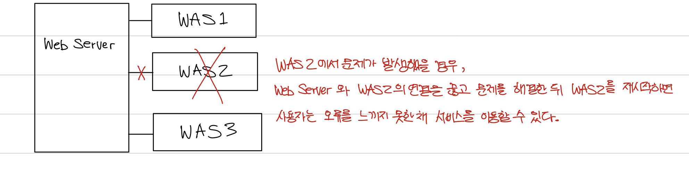
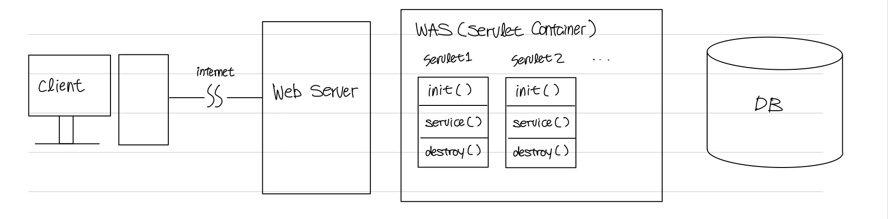

# Web Service Architecture

> ### references 🔗   
> https://gmlwjd9405.github.io/2018/10/27/webserver-vs-was.html

웹 서비스의 구조

## Contents		
* ### [세 가지 구조](https://github.com/mingeun2154/skill/tree/main/web/webapp-architecture#three-architectures)      
* ### [역할 분담](https://github.com/mingeun2154/skill/tree/main/web/webapp-architecture#was-and-web-server)
* ### [서블릿 컨테이너가 하는 일] (https://github.com/mingeun2154/skill/tree/main/web/webapp-architecture#servlet-container)
* ### [servlet의 life-cycle](https://github.com/mingeun2154/skill/tree/main/web/webapp-architecture#life-cycle-of-servlet)

#    

## Three Architectures
1. client -> Web Server -> DB
2. client -> WAS -> DB
3. **client -> Web Server -> WAS -> DB** 

## WAS and Web Server
**WAS 하나만으로도 static, dynamic content 모두 제공할 수 있다.**

하지만 보통 WAS와 Web Server를 분리하여 구성한다.

Web Server를 WAS 앞에 두면 좋은 점
* 기능을 분리하여 서버 과부하를 방지한다. 
* 물리적 분리로 보안 강화. Web server와 WAS는 port number가 다르다.
* 여러 대의 WAS를 연결할 수 있다.

	

## Servlet Container
설정 파일을 참조하여 servlet 객체를 생성하고 관리한다.

client request가 도착하면 컨테이너는 **HttpServletRequest, HttpServletResponse** 타입의 객체를 생성한다.
> Http 요청, 응답을 감싼 java class인것 같다... server-side program은 이 객체들을 통해 요청과 응답을 주고 받는다.

* HttpServletRequest : http request를 servlet에게 전달한다. 헤더 정보, 파라미터, url, uri 등의 정보를 읽어들이는 메서드와 body의 스트림을 읽는 메서드를 가진다.

* HttpServletResponse : http 요청을 보낸 클라이언트에게 응답을 보내기 위해 사용한다.

### 주요 기능
* 서블릿 객체의 **생명 주기** 관리(생성, 활용(method 호출), 제거).
* 네트워크 통신을 추상화하여 API로 제공. socket을 만들어 특정 port를 listening하다가 request가 도착하면 stream을 생성해 요청을 받는다.
* multi-threading 관리 : 새로운 request가 도착할때마다 새로운 java thread를 생성한다. servlet의 service() 메서드를 호출하면 thread는 자동 소멸된다.

## Life-cycle of Servlet
> 아래 과정(스프링 컨테이너에서 일어나는 내부적인 과정)에 대해서는 좀 더 공부해야겠다. 

client -> web server -> WAS -> DB 구조의 동작 과정은 다음과 같다.

* client가 보낸 http request가 web server에 도착. (dynamic content에 대한 요청이라고 가정)
* web server는 요청을 WAS로 보낸다.
* WAS는 관련된 servlet을 heap area에 생성하고 thread를 생성한다.
> 관련된 서블릿❓ dispatcher servlet인가❓ 관련된 서블릿이라는 건 요청이 올 때마다 생성되는건가❓  

* HttpServletRequest, HttpServletResponse 객체를 생성하여 servlet에게 전달.
	* thread는 servlet의 service() 메서드를 호출한다.
	* service 메서드는 request에 맞게 doGet() 또는 doPost() 메서드를 호출한다.
* doGet(), doPost()는 적절한 dynamic content를 Response 객체에 담아 반환한다.
* WAS는 Response 객체를 HttpServletResponse 객체로 바꾸어 Web server로 전달한다.
* Thread 종료, HttpServletResponse, HttpServletRequest 객체 삭제.
